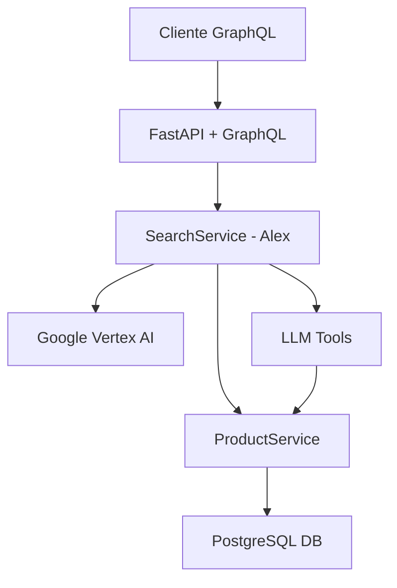

# Reporte Técnico: Demo de Agente de Ventas "Alex"

## Resumen Ejecutivo

Esta demo implementa un **agente de ventas inteligente** llamado "Alex" que puede consultar inventario real y mantener conversaciones naturales con clientes. El sistema combina GraphQL, IA (Google Vertex AI), y una base de datos PostgreSQL para crear una experiencia de venta automatizada.

## Arquitectura del Sistema

### Stack Tecnológico

- **Backend**: Python + FastAPI + SQLAlchemy
- **Base de Datos**: PostgreSQL (Docker)
- **IA/LLM**: Google Vertex AI (Gemini)
- **API**: GraphQL (Strawberry)
- **Herramientas IA**: LangChain + Tools personalizadas
- **Inyección de Dependencias**: aioinject

### Componentes Principales



## Flujo de Funcionamiento

### 1. **Query VerCatalogo**: Consulta Directa de Inventario

```graphql
query VerCatalogo {
  listProducts(limit: 5) {
    productName
    unitCost
    quantityAvailable
    stockStatus
  }
}
```

**Flujo técnico:**

1. **GraphQL Resolver** → `listProducts(limit: 5)`
2. **ProductService** → Ejecuta SQL: `SELECT * FROM product_stocks LIMIT 5`
3. **PostgreSQL** → Retorna datos estructurados
4. **Respuesta**: JSON con productos, precios y stock

**Propósito**: Verificación rápida de inventario disponible

---

### 2. **Query HablarConAlex**: Agente de Ventas Inteligente

```graphql
query HablarConAlex {
  semanticSearch(query: "Hola, ¿tienes zapatillas Nike para correr en asfalto?") {
    answer
  }
}
```

**Flujo técnico complejo:**

#### Paso 1: Procesamiento de Consulta Natural

- **Entrada**: Texto en lenguaje natural del cliente
- **SearchService** recibe la consulta
- **System Prompt** configura a "Alex" como vendedor experto

#### Paso 2: Decisión del LLM

- **Google Vertex AI (Gemini)** analiza la consulta
- **Decisión**: "El cliente pregunta por Nike → usar herramienta `product_search`"
- **Extracción de parámetros**: `search_term: "Nike"`

#### Paso 3: Ejecución de Herramienta

- **ProductSearchTool** recibe parámetros
- **Búsqueda inteligente**: Divide "Nike correr asfalto" → ["Nike", "correr", "asfalto"]
- **SQL dinámico**:

  ```sql
  SELECT * FROM product_stocks 
  WHERE (product_name ILIKE '%Nike%' OR product_sku ILIKE '%Nike%')
     OR (product_name ILIKE '%correr%' OR product_sku ILIKE '%correr%')
     OR (product_name ILIKE '%asfalto%' OR product_sku ILIKE '%asfalto%')
    AND is_active = true
  LIMIT 10
  ```

#### Paso 4: Procesamiento de Resultados

- **Base de datos retorna**: "Nike Air Zoom Pegasus 40" (precio $120, stock 10)
- **Tool retorna**: Datos estructurados del producto

#### Paso 5: Generación de Respuesta de Ventas

- **Segunda llamada al LLM** con:
  - System Prompt (personalidad de Alex)
  - Consulta original del cliente
  - Datos reales del producto
- **Técnicas de venta aplicadas**:
  - Cross-selling (sugiere calcetines)
  - Urgencia ("se agotan rápido")
  - Cierre de venta ("¿Te los envío hoy mismo?")

#### Paso 6: Formato de Respuesta

- **Manejo de contenido estructurado**: Convierte respuesta de Gemini a string
- **Respuesta final**: Texto persuasivo con datos reales

## Configuración de la Base de Datos

### Modelo de Datos: `ProductStock`

```python
- product_id: str (único)
- product_name: str (nombre comercial)  
- product_sku: str (código)
- supplier_id/name: str (proveedor)
- quantity_available: int (stock actual)
- unit_cost: Decimal (precio)
- warehouse_location: str (ubicación)
- is_active: bool (activo/inactivo)
```

### Datos de Prueba

```python
- Nike Air Zoom Pegasus 40: $120, stock 10, Cuenca-Centro
- Adidas Ultraboost Light: $180, stock 5, Cuenca-Centro  
- Puma Velocity Nitro 2: $95.50, stock 20, Quito-Norte
- Calcetines Nike Crew: $15, stock 50, Cuenca-Centro
```

## Características Técnicas Implementadas

### 1. **Búsqueda Inteligente**

- División automática de términos de búsqueda
- Búsqueda OR entre palabras clave
- Búsqueda en múltiples campos (name, sku)

### 2. **Personalidad de Ventas**

- System prompt especializado en técnicas de venta
- Cross-selling automático
- Creación de urgencia
- Cierre de ventas

### 3. **Manejo de Herramientas LLM**

- Tools personalizadas con LangChain
- Inyección de dependencias en tools
- Manejo de errores y logging

### 4. **Arquitectura Robusta**

- Inyección de dependencias con aioinject
- Configuración por variables de entorno
- Logging estructurado
- Manejo async/await completo

## Estado Actual: ✅ Funcional

### ✅ **Funcionalidades Completadas**

1. **Consulta directa de inventario** (VerCatalogo)
2. **Agente conversacional inteligente** (HablarConAlex)
3. **Búsqueda de productos por IA**
4. **Integración completa LLM ↔ Base de Datos**
5. **Técnicas de venta automatizadas**

### 🚧 **Próximas Expansiones**

- **Tool de procesamiento de órdenes** (`order_tool`)
- **Integración con datos RAG** (chunks.csv con políticas)
- **Más productos en el catálogo**
- **Historial de conversaciones**

## Conclusión

La demo demuestra exitosamente la **integración de IA conversacional con datos reales**, creando un agente de ventas que no solo responde preguntas sino que **vende activamente** usando información en tiempo real del inventario. La arquitectura modular permite expansiones futuras manteniendo la robustez del sistema base.
